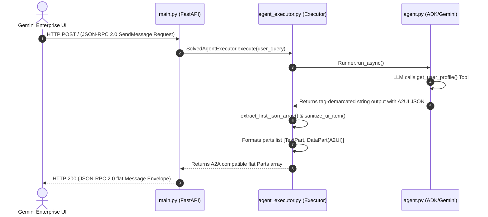

# A2UI User Profile Agent for Gemini Enterprise

This project implements a self-hosted A2UI (Agent-to-User Interface) agent that renders a user profile card in the Gemini Enterprise chat feed, with an external link to LinkedIn.

## Codelab Adaptation
This agent is adapted from the Google Workspace Developer quickstart:
👉 **[Google Chat A2UI Agent Codelab](https://developers.google.com/workspace/add-ons/chat/quickstart-a2ui-agent)**

While the original quickstart was designed for Google Chat via Apps Script, this project adapts the agent to run inside Gemini Enterprise via the A2A JSON-RPC protocol over Cloud Run, with modifications for layout and data formats.

---

## Key Differences from the Codelab

To adapt the quickstart for Gemini Enterprise, the following structural changes were made:

1. **Hyperlink Strategy (Text vs. Card-Frame)**:
   - *Codelab*: Embeds the LinkedIn link as an A2UI button inside an iframe (`WebFrameSrcdoc`) within the card.
   - *Adaptation*: The link is **separated from the card**, outputting a visual card inline, and printing the LinkedIn hyperlink as standard Markdown text below the card in conversational text.
   - *Rationale*: Gemini Enterprise enforces Content Security Policies (CSP) on card iframes which blocks external redirects. Moving the link to standard Markdown text enables click-to-open behavior in a new tab.

2. **Prompt Size (Few-Shot Templates)**:
   - *Codelab*: Injects the A2UI JSON Schema into every model prompt context.
   - *Adaptation*: Replaced the schema injection with a **Few-Shot A2UI Prompt Template**.
   - *Rationale*: Reduces prompt size by **~11.5K tokens per turn**, lowering latency and API cost, and reducing layout changes from the LLM.

3. **A2A Part Mapping**:
   - *Codelab*: Returns a single string containing conversational text and a JSON delimiter.
   - *Adaptation*: Implemented a parser (`agent_executor.py`) inside the FastAPI endpoint to extract the JSON tags and translate the response into A2A `DataPart` components.
   - *Rationale*: Ensures compatibility with Gemini Enterprise A2A standards.

---

## Project Modules

*   **FastAPI Layer (`main.py`)**: Exposes the HTTP REST A2A protocol endpoints including service discovery (`/.well-known/agent.json`) and query execution (`/`). It handles request parsing, logs diagnostic payloads, and formats JSON-RPC 2.0 compliant envelopes back to the caller.
*   **ADK Agent (`agent.py`)**: Configures the core `LlmAgent` using Gemini 2.5 Flash and establishes instructions alongside a dynamic mock-database tool. It uses a Few-Shot layout template to constrain the model's A2UI layout generation for maximum layout fidelity and cost reduction.
*   **A2A Parser & Executor (`agent_executor.py`)**: Orchestrates the ADK runner, captures LLM responses, and parses tags (`<a2ui-json>`). It sanitizes security headers inside WebFrame Srcdoc HTML blocks and maps structural actions into a flat A2A compatible Part array.
*   **A2UI Schema Definition (`a2ui_schema.py`)**: Defines the formal JSON Schema blueprint mapping out all valid UI components, styles, and structure properties of the A2UI framework.
*   **Deployment Scripts (`deploy.sh`, `register.sh`)**: Automated shell tools that package the codebase, set Cloud Run environments, deploy to the active endpoint, and register the new agent definition into the Gemini Enterprise collections.
*   **Integration & Local Testing (`test.py`, `test_local_postback.py`)**: Comprehensive testing harness files. They validate the local parsing pipeline, prompt/Gemini response generation, and mock server endpoints via FastAPI TestClients to assert protocol and Pydantic schema compliance.

---

## Request Workflow

When a user queries the agent in Gemini Enterprise, the request traverses through the following execution pipeline:



1. **Inbound Request**: The Gemini Enterprise client sends a JSON-RPC 2.0 POST envelope carrying the user prompt to the FastAPI server (`main.py`).
2. **Execution Dispatch**: FastAPI parses the message content and passes the cleaned query text to the `SolvedAgentExecutor` inside `agent_executor.py`.
3. **LLM Generation & Tool Calls**: The executor coordinates the ADK runner to query Gemini, which calls the mock database tool (`get_user_profile`) to fetch user variables and formats the output inside strict `<a2ui-json>` blocks.
4. **Tag Extraction & CSP Sanitization**: The executor parses the balanced bracket A2UI list, sanitizes WebFrame CSP tags, and maps conversational text and UI items into flat A2A protocols.
5. **Outbound Response**: FastAPI packages the flat A2A parts list into a valid JSON-RPC 2.0 result envelope and returns it back to Gemini Enterprise for immediate visual rendering.

---


## Local Setup & Configuration

### 1. Create Virtual Environment
Ensure you have Python 3.11+ installed:
```bash
python3 -m venv .venv
source .venv/bin/activate
pip install -r requirements.txt
```

### 2. Configuration (`.env` file)
Create a `.env` file in the parent directory or inside this directory:
```env
# Google Cloud Settings
GOOGLE_GENAI_USE_VERTEXAI=True
GOOGLE_CLOUD_PROJECT=your-project-id
GOOGLE_CLOUD_LOCATION=us-central1
```

---

## Running & Testing Locally

### 1. Unit Verification
To test the agent pipeline, LLM connectivity, and tag parsing locally without running a web server:
```bash
python test.py
```

### 2. Start Local A2A FastAPI Server
To run the HTTP server locally on port `8080`:
```bash
uvicorn main:app --host 0.0.0.0 --port 8080
```

---

## Cloud Deployment

To deploy to the existing Google Cloud Run service:
```bash
chmod +x deploy.sh
./deploy.sh
```
The script loads the Project ID and Region from the environment or `.env` file, packages the directory, and deploys the update.
